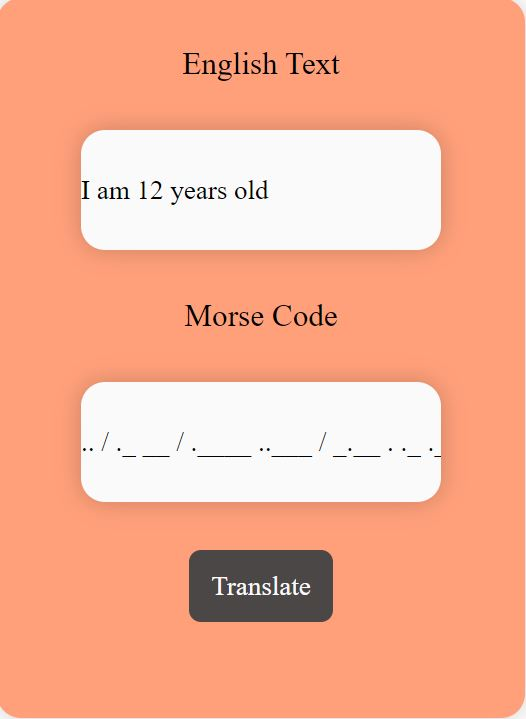

# About
This is a English language to Morse code converter built using HTML, CSS(SCSS), and JavaScript, as part of the software development course by _nology. It can be accessed through: https://gazalneb.github.io/morse-code-translator/

# User Interface
The user sees two display bars, one for English language input and another for Morse-code output. The text (containing English characters and numbers) entered into the first bar gets converted to Morse Code displayed on the second bar when the user presses the translate button. 

# The Display

 

# Potential Improvements

The feature to translate Morse code back to English can be added.